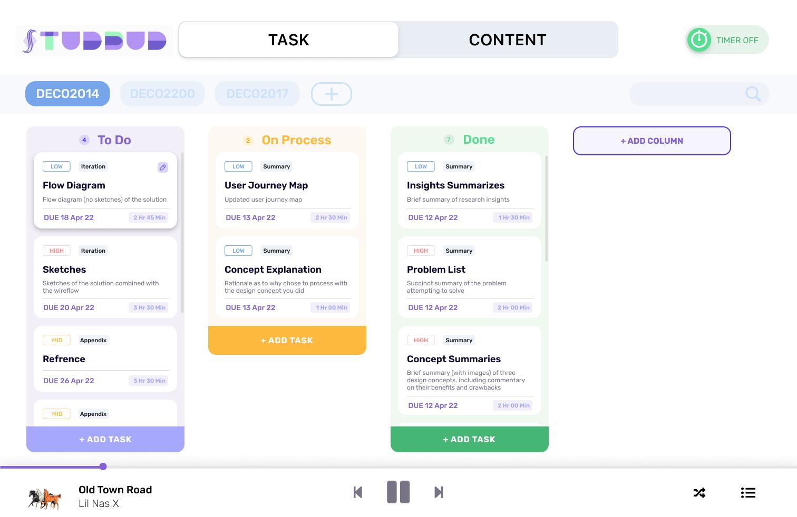

DECO2017 A3 mzhe6329
# StudBud

***
## **Brief introduction to "StudBud" structure and description of iterations**
The overall design is trying to be close to the original UI design draft. Minor modifications have made the entire homepage UI design more standardised and beautiful. The overall style gives a precise, efficient and comfortable visual experience. Some interactive cursor changes in the page and the interactive effect of the icon button and mouse hover operation can bring a better user experience.

*"StudBud" structure Mockup (desktop)*
 
")

*"StudBud" structure Mockup (mobile)*
 
")
 

Since good feedback has been obtained on the layout of the overall function, so the structural layout of the original UI design is retained.

Although the task management and content management at the top is the essential toggle of the application, to be more beautiful and more flexible to adapt to screens and devices of different resolutions, I reduced the visibility and usability without affecting it to achieve the overall unity and the balance of the page.

There is a topic (course) selection bar below the switch. Users can quickly use the buttons to switch and add topic (course) pages. They can search for task keywords or descriptions directly on the management page (if the search results do not match, they will not be displayed). The iterative part includes adding topics. You can click the plus button and enter directly to quickly add new topics (courses) instead of jumping out of the window and entering the tedious steps. This design will be more convenient and save the operation path. I also iteratively improved the problem that the theme selection bar in the previous UI design draft was too conspicuous by appropriately reducing the size of the theme tag to balance it with the overall page.
The toggle/icon in the upper right corner turns on the timer function. And the music bar at the bottom has an expandable or collapsed playlist.

***
## **Task - Kanban Board & List**
Kanban Board and the list can help users split tasks easily and visually manage and plan tasks. Each task card contains a title, description, priority label, category label, due date, and estimated time. This is an excellent opportunity for those who need to manage extensive or responsible tasks for efficient management and execution. Straightforward typography makes each task clear at a glance.

The interface design for edit and add tasks are easy to understand and operate. It displays the modal in a pop-up window that doesn’t occupy the entire screen, which is beautiful and practical.

*Kanban Board Mockup*
 

*Kanban Board Prototype (desktop)*
 
")
*Kanban Board Prototype (mobile)*
 
")

Kanban Board “Add Task” Mockup
 

Kanban Board “Add Task” Prototype (desktop)
 
")
Kanban Board “Add Task” Prototype (mobile)
 
")

*Kanban Board “Edit Task” Mockup*
 

*Kanban Board “Edit Task” Prototype (desktop)*
 
")
*Kanban Board “Edit Task” Prototype (mobile)*
 
")
 

The overall design is roughly restored with the efforts made by Mockup. However, because of the feedback that the fonts of some titles are too thick, the widespread use of bold fonts will bring some pressure on users when using them, which affects the comfortable and efficient theme that StuBud wants to convey. So in the iteration, I mainly made some adjustments in fonts to present a better visual sense and experience.

And after made some iterations on the shadow processing of each task card to better adapt to the mobile phone and other devices that require interaction with the finger touch screen, and each task card can be easily edited. I added shadows to each quest card to make all the cards look like they can be dragged to other columns to reinforce the interaction visually. In addition, I also made different adaptations for the computer version and mobile version to realise editing operations on different interactive devices. In the computer version, as long as the mouse was floating and docked on a task card, an edit button will appear in the upper corner of the card. Click to open the window for editing the task card. To implement this operation more conveniently on the mobile phone, I set all cards to display the edit button in the card's upper right corner. The windows, including editing and adding task cards, have also been designed and adjusted differently according to different devices. Such an iterative design can better adapt to each device and provide a corresponding interface design for other devices to provide a better user experience.

In this interface, I also enriched the interactive way of adding columns. Users only need to click the button, and they can quickly edit and create new columns in the shortcut window generated by the button without the need for a pop-up window.

***
## **Content - Reading List Creator**
Users can freely add related resources links and brief introductions when switching to the content toggle. All cards in the same subject can be opened simultaneously or individually. Each resource card contains a title, description, and link, which is key to helping students condense their learning sessions to manage tasks better and organise content in one application.

*Reading List Mockup*
 

*Reading List Prototype (desktop)*
 
")
*Reading List Prototype (mobile)*
 
")

*Reading List “Add Resources” Mockup*
 

*Reading List “Add Resources” Prototype (desktop)*
 
")
*Reading List “Add Resources” Prototype (mobile)*
 
")

*Reading List “Edit Resources” Mockup*
 

*Reading List “Edit Resources” Prototype (desktop)*
 
")
*Reading List “Edit Resources” Prototype (mobile)*
 
")
 

The reading list interfaces achieved the original expectations, and designed functions are well-realized through the code. Visually, I added some shadows to each card to better reflect the visual effect of the data cards. Similar to the interaction design in Kanban, I made corresponding iterative designs for different adapted devices that are more suitable for the interactive experience of editing operations. In the computer version, as long as the mouse was floating and docked on a reading card, an edit button will appear in the upper corner of the card. Click to open the window for editing the reading card. To implement this operation more conveniently on the mobile phone, I set all cards to display the edit button in the card's upper right corner. The windows, including editing and adding reading cards, have also been designed and adjusted differently according to different devices.

The design of the quick add reading data card automatically generated when browsing to the last card can be more convenient for users to add quickly. I optimised the display on this quick card to make it easier for users to understand what this quick card does.

***
## **Timer - Pomodoro & Stopwatch**
Time management and increased concentration are critical for a student who needs to complete an extensive and complex task. The timer in the upper right corner provides two timing modes to improve engagement and help them record time. Pomodoros can count down the way students want for study time. Users are also free to increase working time and cancel it.

### Pomodoro Timer
When the Pomodoro timer is running, users can intuitively see their timing. Even after closing the popover window, the time will still be displayed in the toggle component in desktop mode.

*Pomodoro Timer default Mockup (desktop)*
 
")
*Pomodoro Timer default Prototype (desktop)*
 
")
*Pomodoro Timer default Prototype (mobile)*
 
")

*Pomodoro Timer start Mockup (desktop)*
 
")
*Pomodoro Timer start Prototype (desktop)*
 
")
*Pomodoro Timer start Prototype (mobile)*
 
")
 

### Stopwatch Timer ###
Using the stopwatch, the user can see the time increment up and down and allow the stopwatch to be started, paused, and stopped.

*Stopwatch Timer Mockup*
 

*Stopwatch Timer Prototype (desktop)*
 
")
*Stopwatch Timer Prototype (mobile)*
 
")
 

In the iteration process, to better code and better fit the design brief's requirements for the Pomodoro timer, I cancelled the operation of swapping selectors in the original design and set the default time of the Pomodoro timer to 25 minutes. Such a change can allow users to reduce the operation path at a certain angle, save the time wasted when setting the clock and improve work efficiency.

***
## **Music Player**
Through preview research, many users felt that switching to other apps made them less productive and distracted. The design and addition of the music player bring user-friendly personality functions to StudBud, which can help students to concentrate more during use. When clicked to expand the playlist window, they can see the status and details of playing songs and other songs in the list.

*Music Player Mockup*
 

*Music Player Prototype (desktop)*
 
")
*Music Player Prototype (mobile)*
 
")
 

The music player part has also tried its best to restore it according to the previous design. But in order to better implement the idea of a music player with the existing code capabilities, I made some minor adjustments to the layout. Although the restored effect of the music playlist is not as beautiful as the previous design, the current design will be more concise, and it can be better unified when adapted to other devices. The straightforward and clear window can reduce the time wasted by the user in the operation of the music player to a certain extent and concentrate more on work and study to improve the user's efficiency and concentration.

***
## **Reflection**
Generally speaking, many parts need reflection in the timer and music player parts. Due to the limited code capability, the mockup effect previously designed is not entirely presented. If there is a chance, I also hope to implement the UI interface of the night mode tried in the original design to assist users in using StudBud as the best efficient tool to assist their work-life in various periods and scenarios.

In general, the iteration and prototype were satisfactory, which could complete the learning efficiency application with relatively complete functional designs. StudBud lives up to its original purpose in every way - designed to support a productive study process for students struggling with complex and extensive, tedious learning tasks/assessments and help students manage and efficiently complete them.

***
## **Reference**
* CSS background-image property. (n.d.). Retrieved May 19, 2022, from https://www.w3schools.com/cssref/pr_background-image.asp. 
* Damme, T. V., Merkenich, J., Coyier, C., Mejia, L., Seyedi, M., Gaebel, D., Khare, M., Graham, G., Rendle, R., El-Alfy, A., Matuzovic, M., &amp; Holt, B. (2021, September 10). A complete guide to flexbox. CSS. Retrieved May 20, 2022, from https://css-tricks.com/snippets/css/a-guide-to-flexbox/. 
* HTML  tag. HTML input tag. (n.d.). Retrieved May 17, 2022, from https://www.w3schools.com/tags/tag_input.asp. 
* W3.CSS Templates. W3.CSS templates. (n.d.). Retrieved May 16, 2022, from https://www.w3schools.com/w3css/w3css_templates.asp.
* O´Donovan, K. (2022, March 07). 18 Best Time Management Apps and tools (2022 updated). Retrieved April 9, 2022, from https://www.lifehack.org/articles/technology/top-15-time-management-apps-and-tools.html
* The Pomodoro app for Doers. (n.d.). Retrieved April 10, 2022, from https://pomelloapp.com/
* Productive study. (n.d.). Retrieved April 8, 2022, from https://www.sydney.edu.au/students/time-management/productive-study.html
* Rehkopf, M. (n.d.). What is a Kanban Board? Retrieved April 8, 2022, from https://www.atlassian.com/agile/kanban/boards
* Inc., A. (n.d.). Apple Design Resources. Retrieved April 12, 2022, from https://developer.apple.com/design/resources/#sf-symbols
* Google. (n.d.). Google Fonts. Retrieved May 2, 2022, from Google Fonts website: https://fonts.google.com/specimen/Rubik
* JS Foundation. (2019). jQuery. Retrieved May 25, 2022, from Jquery.com website: https://jquery.com/
* Tailwind CSS - Rapidly build modern websites without ever leaving your HTML. (n.d.). Retrieved May 25, 2022, from tailwindcss.com website: https://tailwindcss.com/
